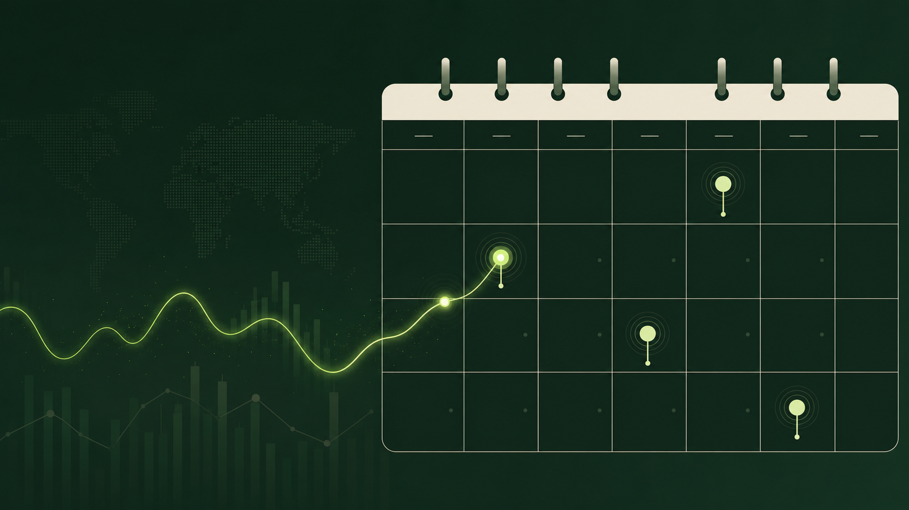

# 美股财报 Apple 日历订阅



一个无需登录、可直接订阅到 Apple 日历的动态财报日历。服务按请求从 Nasdaq Earnings Calendar 拉取未来的美股财报日期，并输出标准 iCalendar (`.ics`) 文件。

## 在线地址

Apple 日历可直接订阅：

```text
webcal://cbrl.bydick.com/earnings.ics
```

证书签发完成后，HTTPS 地址会自动可用：

```text
https://cbrl.bydick.com/earnings.ics
```

证书签发期间的 HTTPS 备用地址：

```text
https://apple-earnings-calendar.soulrabit.chatgpt.site/earnings.ics
```

也可以在浏览器打开 [cbrl.bydick.com](http://cbrl.bydick.com/) 查看订阅地址说明。

## 功能

- 自动拉取未来 45 天的美股财报日程
- 支持通过股票代码筛选，例如 `AAPL,MSFT,NVDA`
- 支持把时间范围扩展到最多 60 天
- 事件标题显示盘前、盘后或时间未公布
- 以全天事件写入 Apple 日历，避免跨时区造成错误的具体时间
- 事件描述包含公司名、财季截止日、EPS 市场预期和统计机构数
- 使用稳定的事件 UID，后续刷新时不会重复创建日历事件
- 输出标准 `text/calendar`，可被 Apple 日历、Google Calendar 等订阅
- 通过 HTTP 缓存头建议约 6 小时更新；实际频率由日历客户端控制

## 订阅地址

全量财报（Apple 日历优先使用 `webcal`）：

```text
webcal://cbrl.bydick.com/earnings.ics
```

只订阅指定股票：

```text
http://cbrl.bydick.com/earnings.ics?symbols=AAPL,MSFT,NVDA
```

指定股票并拉取 60 天：

```text
http://cbrl.bydick.com/earnings.ics?symbols=AAPL&days=60
```

在 macOS Apple 日历中选择“文件 → 新建日历订阅”，粘贴 `webcal://` 地址即可；证书签发后也可以改用完整 HTTPS 地址。

## 本地运行

需要 Node.js `>=22.13.0`：

```bash
npm install
npm run dev
```

打开 `http://localhost:3000/` 查看生成页；构建与测试：

```bash
npm test
```

## 数据说明

数据来自 Nasdaq Earnings Calendar。财报日期和盘前/盘后状态可能会被上市公司或数据源调整；本项目适合作为日程提醒，不构成投资建议。当前版本不包含财报结果、财报电话会录音或个性化推送通知。
